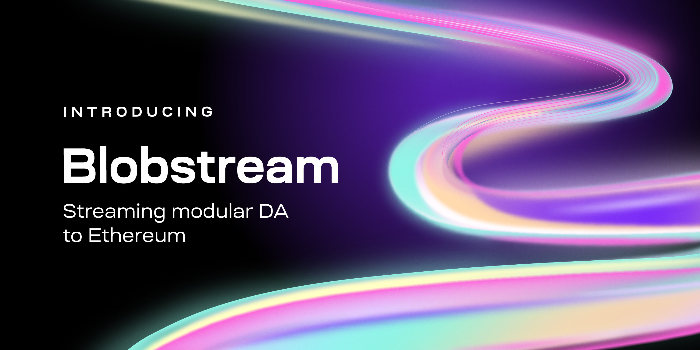

# Integrate with Blobstream

[Blobstream](https://blog.celestia.org/introducing-blobstream/)
is the first data availability solution for Ethereum that securely
scales with the number of users. Formerly known as the [Quantum Gravity Bridge (QGB)](https://blog.celestia.org/celestiums/),
Blobstream relays commitments to Celestia's data root to an onchain light client
on Ethereum, for integration by developers into L2 contracts. This enables Ethereum
developers to build high-throughput L2s using Celestia's optimised DA layer,
the first with Data Availability Sampling (DAS).

The following docs go over how developers can integrate Blobstream. There are also docs on
how to run a [Blobstream orchestrator](../nodes/blobstream-intro.md) as a Celestia validator
which won't be covered in the following sections aimed at developers.

Integrating your L2 with Blobstream requires two components: your onchain smart contract logic, and your offchain client logic.

- [Integrate with Blobstream contracts](../../developers/blobstream-contracts/)
- [Integrate with Blobstream client](../../developers/blobstream-offchain/)
- [Querying the Blobstream proofs](../../developers/blobstream-proof-queries)

You can interact with the Blobstream contracts today on testnet. The Blobstream Solidity
smart contracts are currently deployed on the following Ethereum testnet:

- [Sepolia](https://sepolia.etherscan.io/address/0xf148a9a767f19edcf9a7d125fe143db1b5792ad6) - Which attests to the data published on the Arabica Devnet
